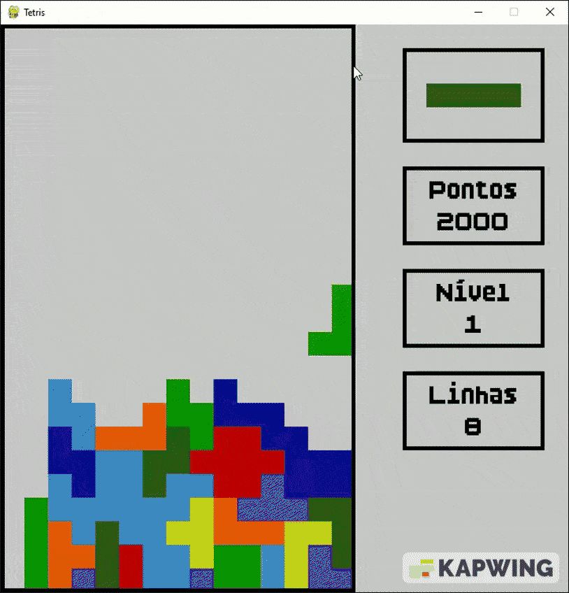
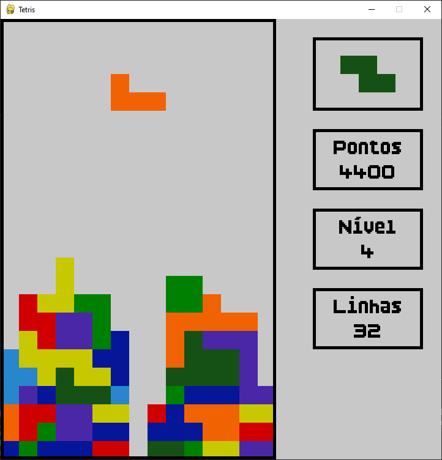
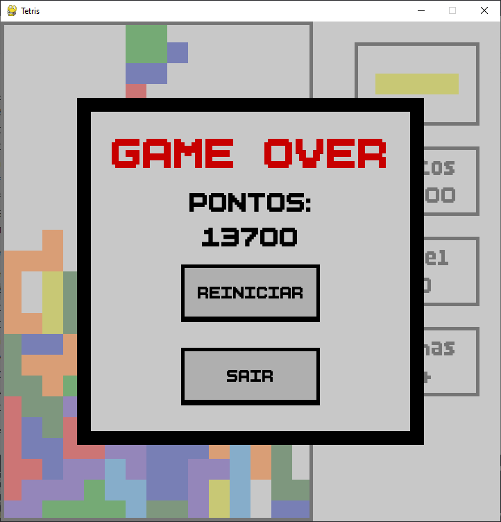

# Tetris em Python (Pygame)

Um jogo de Tetris desenvolvido em Python utilizando Pygame, criado para estudo e portfólio.


---

Funcionalidades:

- Peças com rotação
- Colisão com bordas e peças já fixadas
- Sistema de pontuação
- Aumento automático de nível
- Música e efeitos sonoros (tema, rotação, linha, game over)
- Botões interativos (Reiniciar / Sair)
- Tela de Game Over com sobreposição
- Estrutura modular (jogo, tabuleiro, peça, UI, som, constantes)

---

Estrutura do Projeto:
```
Tetris/
├── main.py 
├── src/
│	├── jogo.py
│	├── tabuleiro.py
│	├── peca.py
│	├── ui.py
│	├── som.py
│	└── constantes.py
├── assets/
│	├── fonts/
│	├── screenshots/
│	└── sounds/
├── README.md
├── requirements.txt
└── LICENSE
```
main.py — ponto de entrada do jogo
jogo.py — loop principal, controle do estado do jogo
tabuleiro.py — lógica do grid, linhas completas, game over
peca.py — lógica da peça atual (mover, rotacionar, cair)
ui.py — botões, textos, elementos visuais
som.py — gerenciamento de efeitos sonoros
constantes.py — cores, tamanhos, configurações do jogo

---

Como Executar:

1 - Instale as dependências:
```
pip install -r requirements.txt
```
2 - Execute o jogo:
```
python main.py
```
---

Controles:
```
Tecla	Ação
←		Mover peça para a esquerda
→		Mover peça para a direita
↓		Acelerar queda
↑		Rotacionar peça
Mouse	Interagir com botões
```
---

Screenshots:

Gameplay


Tela de Game Over


---

Dependências:

- Python 3.10+
- Pygame 2.5+

---

Licença:

Este projeto está licenciado sob a Creative Commons Attribution–NonCommercial 4.0 (CC BY-NC 4.0).
Você pode usar, modificar e distribuir, DESDE QUE:
- dê os devidos créditos ao autor (Ailton);
- não utilize o projeto para fins comerciais.


Texto completo da licença:
https://creativecommons.org/licenses/by-nc/4.0/

---

Sobre o autor


Desenvolvido por Ailton, como projeto de portfólio e prática de desenvolvimento de jogos com Python.

